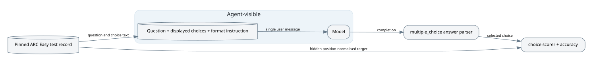

## Summary {.unnumbered}

ARC Easy asks a model to answer public grade-school science multiple-choice questions. The harness shows the question and choices, parses an `ANSWER: <letter>` response, and compares the selected position with a hidden target.

- [The supplied 100% score is not a benchmark-wide estimate](#limited-run): it covers 5 limit-selected items from 2,376 (0.21%).
- [Target conversion is sound](#target-alignment): all 2,376 pinned records mapped an answer key to a displayed option, and all five logged samples exactly matched source.
- [No direct answer leak was observed](#leakage): none of five model-visible transcripts contained the hidden target. This does not test memorisation of a public benchmark.
- [Parsing adds a small format-compliance requirement](#format): bare `A` and `The answer is A` were rejected, while `ANSWER: A` was accepted. The instruction explicitly requires the accepted form and no logged attempt was affected.
- [The test set has five duplicate question pairs](#duplicates), creating five redundant observations among 2,376 records (0.21%).

Coverage comprised source at `0dacad3`, the complete pinned ARC Easy test parquet, and all five attempts in the supplied log. No new model run was commissioned.

## Benchmark architecture {.unnumbered}

The target stays outside the agent-visible boundary. There are no tools, sandbox, judge model or feedback loop.

---

# Full audit

## The task

### Target-aligned multiple choice {#target-alignment}

All 2,376 pinned test records have unique IDs, non-empty questions and a source answer key present among their labels. The transformation handled 2,365 four-choice, seven three-choice and four five-choice items. It also correctly position-normalised 97 records labelled `1` to `4`; no record failed the transformation ([population table](evidence/dataset_analysis.json), [source](evidence/arc_py_numbered.txt)).

All five logged questions, choices and hidden targets equal their pinned records field-for-field ([join](evidence/log_source_join.json)). This establishes mechanical target alignment, not independent scientific adjudication of every gold answer.

The items seen in the run are ordinary science questions. For example, `Mercury_417466` asks why photosynthesis underlies most food webs and offers sunlight as option A ([transcript](evidence/recorded_samples.txt)).

### Small within-test duplication {#duplicates}

Five exact question strings each occur twice, leaving 2,371 unique question strings among 2,376 records. These five excess observations can slightly overweight those questions, but cannot materially explain a full-run score by themselves ([duplicate groups](evidence/dataset_analysis.json)).

## The grader

The built-in `multiple_choice` solver parses a response into selected positions. The deterministic `choice` scorer compares those positions with the hidden position-normalised target, then accuracy averages the results ([installed code](evidence/builtin_code.txt)). All five recorded answers equal their targets and received `C` (Inspect's correct code), reproducing 5/5 accuracy.

### Explicit but strict response format {#format}

The parser accepted `ANSWER: A`, lowercase, parentheses and a trailing period. It rejected bare `A`, `The answer is A`, and `ANSWER: A because sunlight` in fixed-candidate probes ([probe](evidence/parser_probe.txt)). Thus the score can count a semantically correct choice as wrong when a model ignores formatting. The prompt says the entire response must use exactly that format, and all five recorded completions complied, so the measured effect here is zero.

## The harness and environment

### No observed direct leakage {#leakage}

Each of five transcripts contains one user message with only the format instruction, question and displayed choices, followed by one assistant answer. Targets are separate log fields; there are no system messages, tool calls, sandbox or sample metadata ([recorded samples](evidence/recorded_samples.json), [header](evidence/log_inventory.json)). This rules out direct prompt leakage in these five attempts. It does not rule out training-data memorisation because ARC is public, nor leakage in unobserved attempts.

The logged package was `inspect_evals 0.23.0` with `inspect_ai 0.3.276`. ARC source at the v0.23.0 tag is identical to audited HEAD for this task, including dataset revision `210d026f…`.

## Aggregation and limits

### Five-item smoke result {#limited-run}

The log configured `limit=5`, one epoch and no shuffle. It completed and scored all 5 attempts without errors, reporting accuracy 1.0 and standard error 0.0 ([header and summaries](evidence/log_inventory.json)). These are 5 of 2,376 items, selected by dataset order rather than a declared random design. The zero standard error describes five identical outcomes; it does not make 100% a credible estimate of full-test accuracy.

The recorded run used `openai/gpt-5.6` on 4 October 2026. It consumed 455 input and 35 output tokens, 490 total. The log records no monetary cost. No audit model jobs were run.

## How agents approach it

The only recorded model answered directly in the requested format on all five items. There were no explanations, retries, refusals, tool use or invalid outputs. Five examples are too few to estimate behaviour rates or compare strategies.

## How it is built

The implementation is short and reproducible: it pins the Hugging Face dataset revision, preserves choice order, converts heterogeneous source labels to displayed letters, and uses Inspect's matching solver/scorer pair. The README's “simple accuracy” description matches the logged aggregation. The main reporting safeguard is operational: label limit-based runs as smoke tests rather than ARC Easy results.

Method: source and log evidence were read with Inspect's log API; the `.eval` archive was not unpacked. The exact pinned parquet was downloaded from Hugging Face and analysed with the retained scripts under `report/evidence/`.
